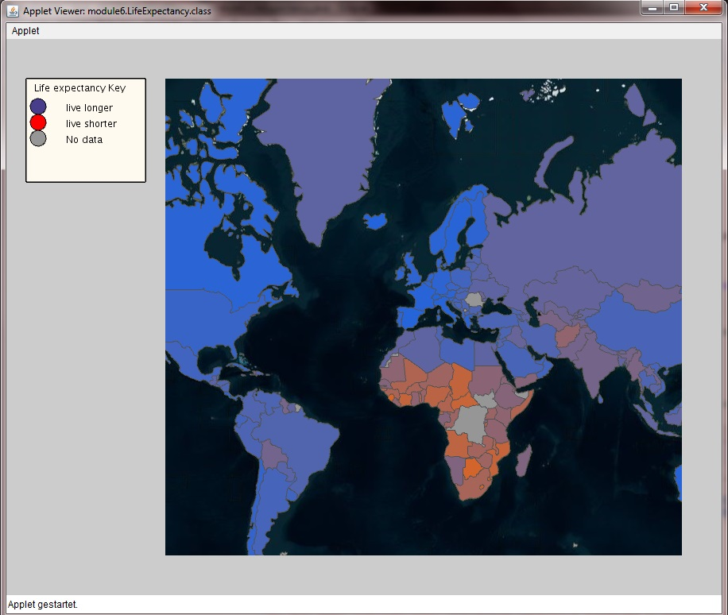

# Earth quake & life expectance interactive map [![Earthquake][1]][2]

Earthquake is an application with an interactive map displaying earthquake data.

Included with this app an interactive map for:
                    * life expectancy.
                    * Airports connection in the world.

## Description
--------------
implemented interactive earthquake map with a basic GUI and markers. using the same UML design of earth quake map for Airport connections and life expectancy map.

## Covered topics 
--------------------------------
- Papplet in java

- object oriented design to solve our problem and sustain readable, non repeated code.

- data representation in object oriented and using the power of polymorphysim.

- using sorted data to optimise interactivity with the map and code execution.

- exposed to build-in libraries in java to represent marks in map.

- reading/parsing json/csv data files.

- data fetching from online database of earth quakes. 

- introduced to map providers such as google/microsoft. (free now but I guess the business model of google to charge programmers in the future)

- introduced to [processing][2] libraries and their practical use.

- developing the mindset behind choosing which type of data for our problem or which sort algorithm fit our problem.

- handling heavy complex data for visualization and making sure function have the shortest optimised run time complexity.
 

## INSTALLATION
---------------
Import this folder in Eclipse ('File' -> 'Import' -> 'Existing Projects into
Workspace', Select this folder, 'Finish')
TODO: bash instruction

## MANUAL INSTALLATION
----------------------
If the import does not work follow the steps below.

- Create new Java project
- Copy+Paste all files into project
- Add all lib/*.jars to build path
- Set native library location for jogl.jar. Choose appropriate folder for your OS.
- Add data/ as src

## TROUBLE SHOOTING
-------------------
Switch Java Compiler to 1.6 if you get VM problems. (Processing should work with Java 1.6, and 1.7)

## Contributing
---------------
Always welcoming new ideas or if anyone would like to add unit-test
email me for any Ideas related to GIS, map visualising ...

## Screen images 
----------------

earth quake

earthquake in japan area

airport connection map

life expectancy map

life expectancy highlighted

[1]: https://cdn0.iconfinder.com/data/icons/small-n-flat/24/678111-map-marker-128.png
[2]: https://processing.org/reference/
